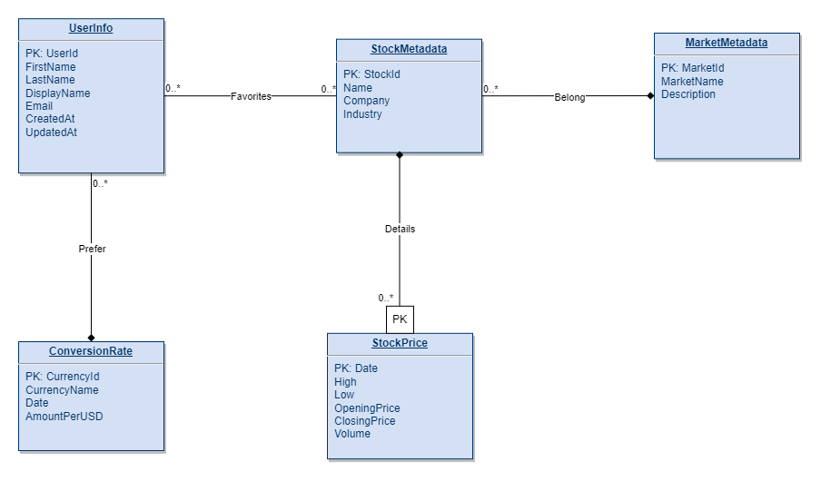

# Database Design

## UML Diagram



## Entities

#### 1. UserInfo

This is an entity regarding each user and their login information.

- `UserID`: a unique identifier to distinguish between users
- `FirstName`: first name of the user, a string attribute
- `LastName`: last name of the user, a string attribute
- `DisplayName`: a self-selected name that displays on the website, a string attribute
- `Email`: the login email address of the user, a string attribute
- `CreatedAt`: a time stamp to record the time that the user creates the account
- `UpdatedAt`: a time stamp to record the last time that the user updates the account information

This entity is designed with the following assumptions:

1. Every user in the platform has a unique `UserID` that cannot be modified.
2. Users can change their `DisplayName` which will result in an update operation for this table. The time that the user update those information will be record in `UpdatedAt` column
3. One user could only select one specific currency which has a unique id. They can change their selected currency through settings
4. The users are allowed to login through their Google SSO, requiring their email to be unique


#### 2. ConversionRate

This is an entity regarding converting user-selected currency into US dollars.

- `CurrencyID`: a unique identifier to distinguish between user’s currency
- `CurrencyName`: the name for the currency, a string attribute
- `Date`: the date for the currency exchange rate
- `AmountPerUSD`: the currency exchange rate into US dollars on a given date

This entity is designed with the following assumptions:

1. Every currency will have a unique ID and a unique name
2. One user could only selected one specific currency


#### 3. StockMetadata

This is an entity regarding each stock and its necessary information.

- `StockId`: a unique identifier to distinguish between stocks
- `Name`: the name of the stock, a string attribute
- `Company`: the name of the company that the stock belongs to, a string attribute
- `Industry`: the type of industry that the company belongs to, a string attribute

This entity is designed with the following assumptions:

1. Every stock will have a unique id, a unique name in a market, and a unique company name
2. A single stock can only correspond to one company
3. A single stock can only correspond to one country’s market

#### 4. StockPrice

This is an entity designed to store the price information for stocks.

- `Date`: a unique identifier corresponding to the date of the stock price information
- `High`: the highest price of a particular stock on the given date
- `Low`: the lowest price of a particular stock on the given date
- `OpeningPrice`: the open price of a particular stock on the given date
- `ClosingPrice`: the close price of a particular stock on the given date
- `Volume`: the number of trades for a particular stock that happened on the given date

This entity is designed with the following assumptions:

1. A stock's price fluctuates daily, and as a result, the price information of a specific stock is determined by both StockId and Date.
2. This entity is a weak entity as it needs to use StockId, borrowed from the StockMetadata entity, to uniquely identify each record (per the reason specified above).


#### 5. MarketMetadata

This is an entity to store the necessary information for different country’s stock market.

- `MarketID`: a unique identifier to distinguish between stock markets
- `MarketName`: the name of the stock market, a string attribute
- `Description`: the basic information of the stock market, a string attribute

This entity is designed with the following assumptions:

1. Every stock market should have a unique id, a unique name, and a unique description. However, only a unique id is sufficient to determine each market.

## Relations

**1. Favorites**

- "Favorites" is a many-to-many relationship between `UserInfo` and `StockMetadata`.  Users can add their favorite stocks to their collections.
- Assumption: Each user can have multiple favorite stocks, and a stock can be marked as a favorite by many users.

**2. Prefer**

- "Prefer" is a one-to-many relationship between `ConversionRate` and `UserInfo`. Users have their own preferences about currency
- Assumption: Each user only has one preferred currency. However, a currency can be preferred by many users.

**3. Details**

- "Details" is a one-to-many relationship between `StockMetadata` and `StockPrice`. A stock may have different prices per day.
- Assumption: Each stock could have different prices at different dates. However, a stock price at a certain date only pertains to one stock.

**4. Belong**

- "Belong" is a one-to-many relationship between `MarketMetadata` and `StockMetadata`. Each stock belongs to one market.
- Assumption: Each stock can only belong to one market. However, a market can include multiple different stocks.

## 3NF Normalization

Functional dependencies are vital to our application as they are intuitive relationships that real-world users can deduce, therefore, we decided to implement 3NF normalization rather than BCNF which might not preserve some functional dependencies.

### Functional dependencies on each table:

**1. UserInfo**

- `UserId` -> `CurrencyId`, `FirstName`, `LastName`, `DisplayName`, `Email`, `CreatedAt`, `UpdatedAt`
- `Email` -> `UserId`

**2. ConversionRate**

- `CurrencyId` -> `CurrencyName`, `Date`, `AmountPerUSD`
- `CurrencyName` -> `CurrencyId`

**3. StockMetadata**

- `StockId` -> `MarketId`, `Name`, `Company`, `Industry`
- `Company` -> `StockId`
- `Name`, `Market` -> `StockId`

**4. StockPrice**
- `StockId`, `Date` -> `High`, `Low`, `OpeningPrice`, `ClosingPrice`, `Volume`

**5. MarketMetadata**

- `MarketId` -> `MarketName`, `Description`
- `MarketName` -> `MarketId`
- `Description` -> `MarketId`

### 3NF Analysis

For all tables, all non-attributes are dependent on its candidate key. All other dependencies involve keys on its RHS, meaning no transitive dependencies in the schema. Therefore, no 3NF violations are detected.

## Relational Schema

Here we will convert the database design into tables (5 entities, 1 relationship)

**1. UserInfo**
```sql
UserInfo (
    UserId INT [PK]
    CurrencyId INT [FK to ConversionRate.currencyId]
    FirstName VARCHAR(20)
    LastName VARCHAR(20)
    DisplayName VARCHAR(20)
    Email VARCHAR(50)
    CreatedAt TIMESTAMP
    UpdatedAt TIMESTAMP
)
```

**2. ConversionRate**
```sql
ConversionRate (
    CurrencyId INT [PK]
    CurrencyName VARCHAR(10)
    Date DATE
    AmountPerUSD REAL
)
```
**3. StockMetadata**
```sql
StockMetadata (
    StockId INT [PK]
    MarketId INT [FK to MarketMetadata.marketId]
    Name VARCHAR(50)
    Company VARCHAR(50)
    Industry VARCHAR(50)
)
```
**4. StockPrice**
```sql
StockPrice (
    Date DATE [PK]
    StockId INT [PK] [FK to StockMetadata.stockId - ON DELETE CASCADE]
    High REAL
    Low  REAL
    OpeningPrice REAL
    ClosingPrice  REAL
    Volume INT
)
```
**5. MarketMetadata**
```sql
MarketMetadata (
    MarketId INT [PK]
    MarketName VARCHAR(50)
    Description VARCHAR(255)
)
```
**6. Favorites**
```sql
Favorites (
	UserId INT [PK][FK to UserInfo.userId]
	StockId INT [PK][FK to StockMetadata.stockId]
)
```