# Database Implementation and Indexing

## GCP Connection

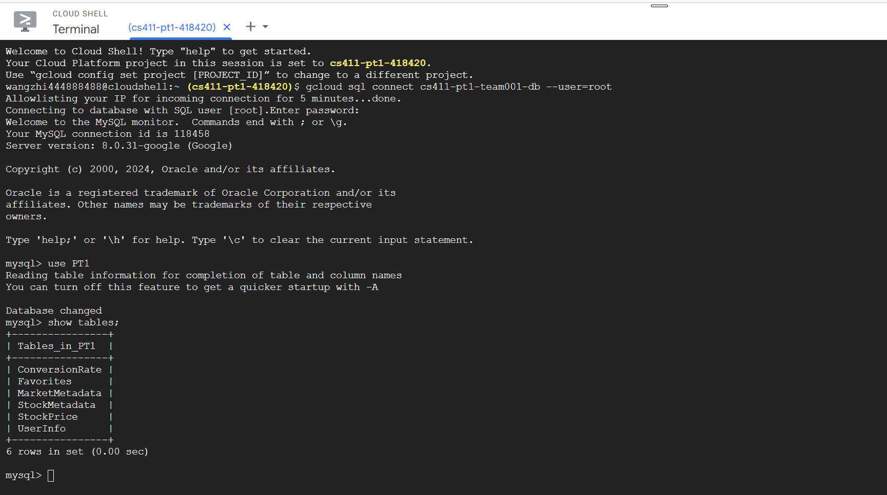

## DDL Commands

### Entities

**1. UserInfo**

```sql
CREATE TABLE UserInfo (
    UserId INT AUTO_INCREMENT PRIMARY KEY,
    CurrencyName VARCHAR(10),
    FirstName VARCHAR(20),
    LastName VARCHAR(20),
    DisplayName VARCHAR(20),
    Email VARCHAR(50) UNIQUE,
    CreatedAt TIMESTAMP DEFAULT CURRENT_TIMESTAMP,
    UpdatedAt TIMESTAMP DEFAULT CURRENT_TIMESTAMP ON UPDATE CURRENT_TIMESTAMP,
    FOREIGN KEY (CurrencyName) REFERENCES ConversionRate(CurrencyName)
);
```

**2. ConversionRate**

```sql
CREATE TABLE ConversionRate (
    CurrencyName VARCHAR(10) PRIMARY KEY,
    Date DATE PRIMARY KEY,
    AmountPerUSD REAL
);
```

**3. StockMetadata**

```sql
CREATE TABLE StockMetadata (
    StockId INT AUTO_INCREMENT PRIMARY KEY,
    MarketId INT,
    Name VARCHAR(50),
    Company VARCHAR(50),
    Industry VARCHAR(50),
    FOREIGN KEY (MarketId) REFERENCES MarketMetadata(MarketId)
);
```

**4. StockPrice**

```sql
CREATE TABLE StockPrice (
    Date DATE,
    StockId INT,
    High REAL,
    Low REAL,
    OpeningPrice REAL,
    ClosingPrice REAL,
    Volume INT,
    PRIMARY KEY (Date, StockId),
    FOREIGN KEY (StockId) REFERENCES StockMetadata(StockId) ON DELETE CASCADE
);
```

**5. MarketMetadata**

```sql
CREATE TABLE MarketMetadata (
    MarketId INT AUTO_INCREMENT PRIMARY KEY,
    MarketName VARCHAR(50),
    Description VARCHAR(255)
);
```

### Relationships

**6. Favorites**

```sql
CREATE TABLE Favorites (
    UserId INT,
    StockId INT,
    PRIMARY KEY (UserId, StockId),
    FOREIGN KEY (UserId) REFERENCES UserInfo(UserId) ON DELETE CASCADE,
    FOREIGN KEY (StockId) REFERENCES StockMetadata(StockId) ON DELETE CASCADE
);
```

## Data Insertion

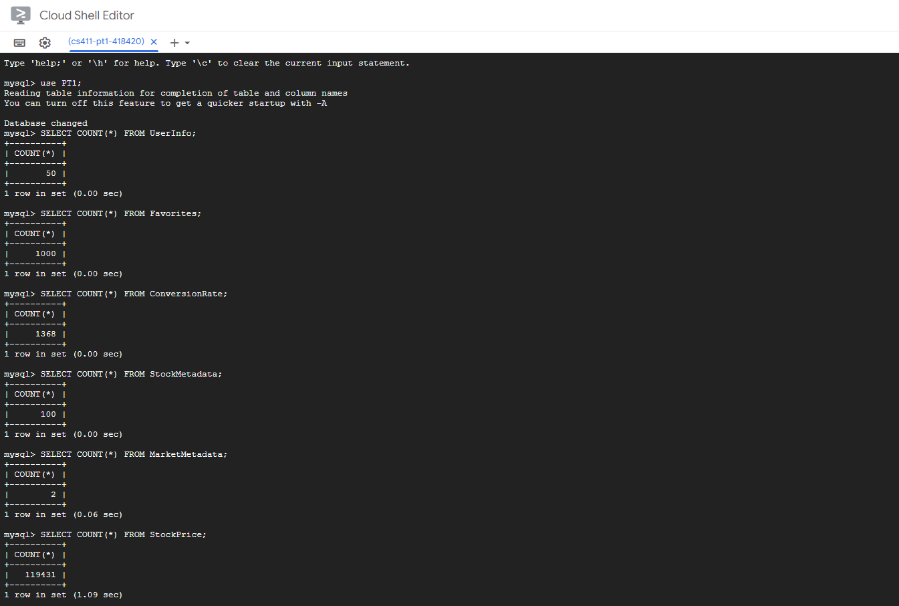

## Advanced SQL Queries

#### Query1:

Retrieve stocks filtered by the query in the search bar, using stock name and its company (in this case `query`="A"). Return the stock id, stock name, its owner company, and their average closing price.

```sql
SELECT FilteredStock.StockId, FilteredStock.StockName, FilteredStock.StockCompany, AVG(StockPrice.ClosingPrice) AS AvgPrice
FROM StockPrice JOIN (
    SELECT StockMetadata.StockId, StockMetadata.Name AS StockName, StockMetadata.Company AS StockCompany
    FROM StockMetadata JOIN MarketMetadata ON StockMetadata.MarketId = MarketMetadata.MarketId
    WHERE MarketMetadata.MarketName = "USA" AND (
        StockMetadata.Name LIKE CONCAT('%', "A", '%')
        OR StockMetadata.Company LIKE CONCAT('%', "A", '%')
    )
) as FilteredStock ON StockPrice.StockId = FilteredStock.StockId
GROUP BY FilteredStock.StockId
LIMIT 15;

```

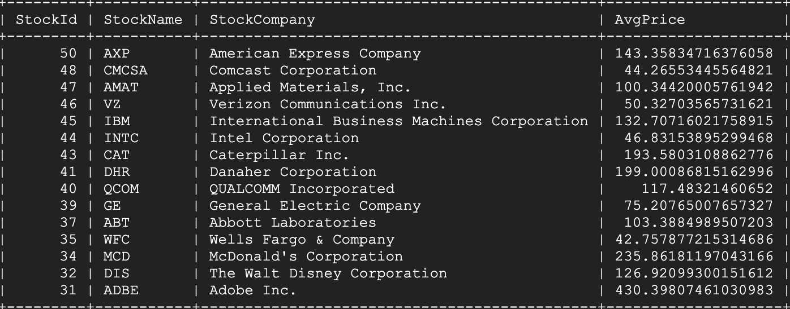

#### Query2:

Retrieve stocks filtered by the query in the search bar, using stock's industry (in this case `query`="Tech"). Return the stock id, stock name, its owner company, and their average closing price.

```sql
SELECT FilteredStock.StockId, FilteredStock.StockName, FilteredStock.StockCompany, AVG(StockPrice.ClosingPrice) AS AvgPrice
FROM StockPrice JOIN (
    SELECT StockMetadata.StockId, StockMetadata.Name AS StockName, StockMetadata.Company AS StockCompany
    FROM StockMetadata JOIN MarketMetadata ON StockMetadata.MarketId = MarketMetadata.MarketId
    WHERE MarketMetadata.MarketName = "USA" AND StockMetadata.Industry = "Technology"
) as FilteredStock ON StockPrice.StockId = FilteredStock.StockId
GROUP BY FilteredStock.StockId
LIMIT 15;
```

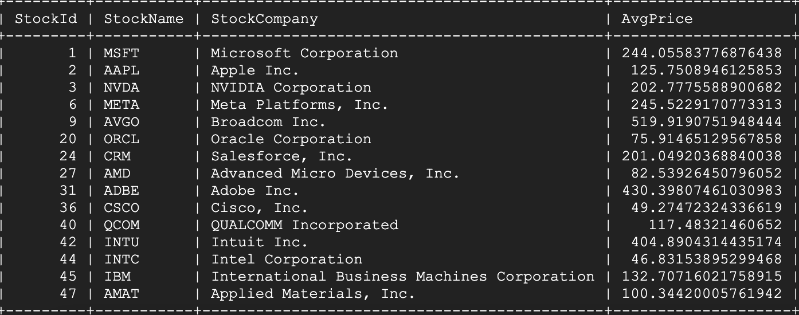

#### Query3:

Retrieve the average closing price for stocks in the default view, between the specified time period, grouped by specified interval (in this case, the interval is monthly).

```sql
SELECT
    sp.StockId,
    sm.Name AS StockName,
    YEAR(sp.Date) AS Year,
    MONTH(sp.Date) AS Month,
    AVG(sp.ClosingPrice) AS AvgClosingPrice
FROM
    (SELECT *
    FROM StockPrice
    WHERE StockId IN (1, 2, 3, 4, 5)) as sp
JOIN
    (SELECT *
    FROM StockMetadata
    WHERE StockId IN (1, 2, 3, 4, 5)) as sm
ON
    sp.StockId = sm.StockId
WHERE
    sp.Date BETWEEN '2023-06-01' AND CURDATE()
GROUP BY
    sp.StockId,
    YEAR(sp.Date),
    MONTH(sp.Date)
LIMIT 15;
```

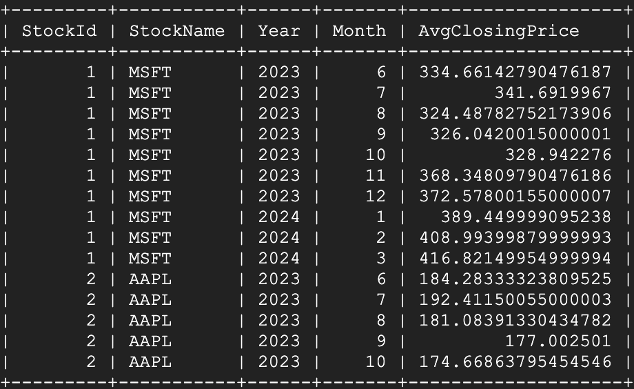

#### Query4:

Retrieve the average closing price for stocks in the favorites list of a user (in this case, userId = 1) within the current year, grouped by the specified interval (in this case, weekly). This functionality is only accessible when users are logged in.

```sql
SELECT f.StockId, sm.Name AS StockName, YEAR(sp.Date) AS Year, WEEK(sp.Date) AS Week, AVG(sp.ClosingPrice) AS AvgClosingPrice
FROM
    (SELECT *
    FROM Favorites
    WHERE UserId = 1) as f
JOIN
    StockMetadata sm ON f.StockId = sm.StockId
JOIN
    StockPrice sp ON f.StockId = sp.StockId
WHERE
    sp.Date BETWEEN '2024-01-01' AND CURDATE()
GROUP BY
    f.StockId,
    YEAR(sp.Date),
    WEEK(sp.Date)
LIMIT 15;
```

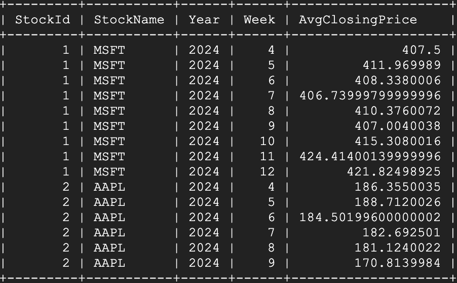

## Indexing Analysis

#### Query1:
Run `EXPLAIN ANALYZE` for the original query, the output is
Result:
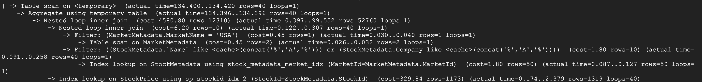

First, we created an index on `MarketId` in the `MarketMetadata` table:
```sql
CREATE INDEX market_metadata_marketname_idx ON MarketMetadata(MarketName);
```
Result:
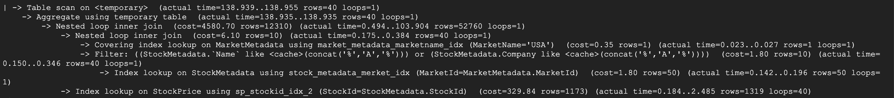

Next, we created an index on `Name` in the `StockMetadata` table: 
```sql
CREATE INDEX stock_metadata_name_idx ON StockMetadata(Name);
```
Result:
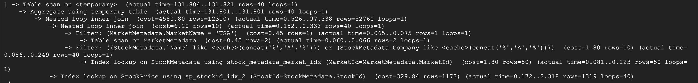

Then, we try an index on `Company` in the `StockMetadata` table instead.
```sql
CREATE INDEX stock_metadata_company_idx ON StockMetadata(Company);
```
Result:
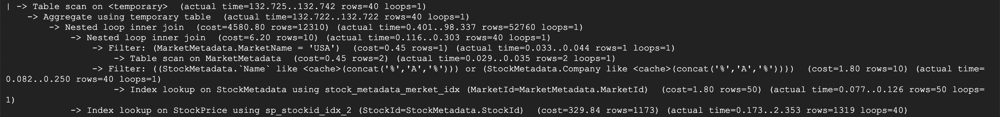

#### Analysis:
In the first experiment, we can see that the physical plan change from performing table scan on `MarketMetadata` and then filter by matching `MarketName` to our query `"USA"` to looking up index instead. Theoretically, this should help reducing the cost as index supposed to reduce our search space by only going into the blocks with potential matches (for example, if we use B-Tree, then we can decide if we want to go left or right based on the value). However, from our experiment, we can see that the cost barely decreases in this use case. This makes sense as our `MarketMetadata` is very small (only 2 records available), therefore, using index would not help reduce search space as much as other general scenarios where the table is larger. Thus, removing this index and using only the table scan is sufficient.

In the second experiement, we can see that the physical plan doesn't change from the default scenario without any indexes, and the cost is also the same. This makes sense as we are trying to search for stocks with name containing our query as substring (let's call this substring search), and not search for stocks with name exactly matching our query (let's call this exact search). In the case of exact search, we can create an index on the stock name, and let it reduce search space by searching only the area with potential matches. For example, if we use B-Tree and the current index is "Microsoft", if we want to search for "Tesla", we can search only the area on the right as "T" comes after "M". However, in the case of substring search, any stocks can have or don't have our query in its name, as the ordering provide by the index is on the whole string of name (not on whether the name contains the query or not). Thus, we have to go through every record one-by-one to see if the query is in the name or not, resulting in the table scan operation. Moreover, we cannot create an index or provide some pre-computed ordering on whether the stocks that has the query in its name, as there are unlimited posssibilties for our query. Thus, we can remove this index and use only the default table scan.

In the last experiment, this provide the same results as when we try indexing on `Name` in the `StockMetadata` table. This makes sense because of the same reason, as we are also finding the stocks that has our query in its company name (the substring search), so we have to go through each stock one-by-one with the table scan operation. Thus, we can also remove this index and use only the default table scan.

Any other attributes involved in the query (i.e. `MarketId` and `StockId`) are primary keys, so we should not try to provide additional indexes as that would be redundant. Therefore, after experimenting on all attributes involced, we don't have to provide any additional indexes as the original physical plan is already optimal.

#### Query2:

Run `EXPLAIN ANALYZE` for the original query, the output is
Result:
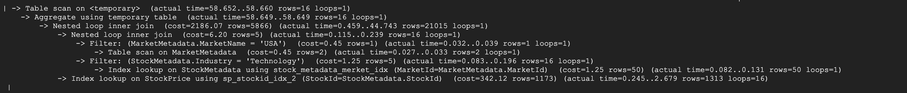

First, we created an index on `Industry` in the `StockMetadata` table:
```sql
CREATE INDEX stockmetadata_industry_idx ON StockMetadata(Industry);
```
Result:
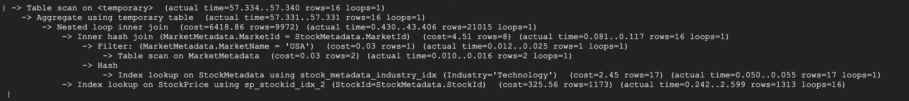

Next, we created an index on `MarketName` in the `MarketMetadata` table: 
```sql
CREATE INDEX marketmetadata_marketname_idx ON MarketMetadata(MarketName);
```
Result:
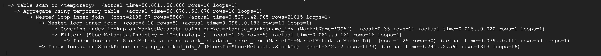

Then, we try an index on `Industry` in the `StockMetadata` table and `MarketName` in the `MarketMetadata` table.
```sql
CREATE INDEX stockmetadata_industry_idx ON StockMetadata(Industry);
CREATE INDEX marketmetadata_marketname_idx ON MarketMetadata(MarketName);
```
Result:
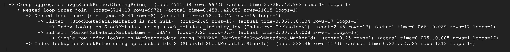

#### Analysis:
Without any newly created indexes, we achieve a baseline cost of 2186.07. In the default setting, the database utilizes existing indexes (on primary keys) to optimize query execution.
 
Indexing on StockMetadata.Industry gives us a total cost of 6418.86. The reason for this indexing was to optimize the filtering process on the `Industry` attribute in the WHERE clause, aiming to reduce the overall cost. The physical plan of this indexing is to filtering those with `Industry = “Technology”` first. This results in we getting stocks in the Technology field from both the Thai and US market. Then, the results are joined again to only contain those from the US market. On the other hand, the default setting (without any indexes) chooses to filter the records matching MarketId of the “USA” market first, before filtering by `Industry = “Technology”`. In the outmost join operation, the default setting results in 5866 rows with a cost of 2186.07, compared to the new strategy’s 9972 rows with a cost of 6418.86.

Indexing on MarketMetadata.MarketName gives us a total cost of 2185.97. The cost was insignificantly less than the default cost. The indexing strategy was intended to optimize the filtering operation by leveraging the index on `MarketName` attribute to find the correct `MarketId` with lower cost. However, with only two markets to index on, the optimization is limited and does not differ from the default table scan operation (as discussed in the first query). Thus, this resulted in a similar cost to the default strategy with no indexing, and therefore, we can remove this index as the default strategy is sufficient.

Indexing on StockMetadata.Industry and MarketMetadata.MarketName gives us a total cost of 3714.18. The query conducts an index lookup on MarketMetadata where MarketName = `USA`, which is not optimal due to the small size of MarketMetadata table (as discussed above). With the index on Industry, the query then filter all stocks with “Technology” field, both from Thai and the U.S. market, before joining with the retrieved MarketId to get only the stocks from the U.S. market. Compared to the default strategy of filtering only U.S. stocks first, then using index to filter “Technology” stocks, we increased the cost in the join operation. This suggests that while the filtering steps on individual columns are optimized, the overall plan which involves processing 9972 rows, leads to added complexity. The default strategy of pushing market filtering into StockMetadata relation is thus the optimal strategy, and we should remove these indexes.

Since any other attributes involved in the query (i.e. `MarketId` and `StockId`) are primary keys, we should not try to provide additional indexes as that would be redundant. Therefore, after experimenting on all attributes involced, we don't have to provide any additional indexes as the original physical plan is already optimal.

#### Query3:
Run EXPLAIN ANALYZE for the third query, the output is:
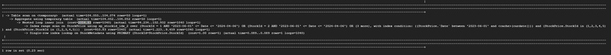

##### Analysis:
The overall cost of this query is 2054.83. In this scenario we want to get the detailed information of stocks within the specified list (stocks that the users want to display in their graph) within the specified interval. This involves only the table `StockMetadata` and `StockPrice`. As we only consider columns `StockId` and `Date` in our query (the WHERE clause we used to join the tables and retrieve data), these two are the only candidates to create indexes. However, we have already defined that `StockId` be the primary key for table `StockMetadata` and `(Date, StockId)` as the primary key for the table `StockPrice`, and since we did not search based on other columns in those two tables, we thus don't need to create additional indexes for the query. The database engine will create indexes for the primary keys that we selected automatically which already help the data retrieval process and join operations execute efficiently.

#### Query4:

Run EXPLAIN ANALYZE for the fourth query, the output is:
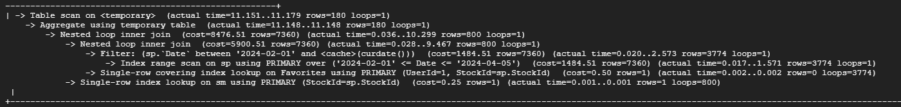

##### Analysis:

As we can see, the overall cost of this query is 8476.51. While creating appropriate indexes can often optimize a query and reduce its cost by facilitating efficient data retrieval, such as indexing columns frequently used in filtering, joining, and sorting operations, in this specific case, such optimization measures won't impact the performance. The options for us to index on in this query are `StockId`, `UserId`, and `Date`. However, all of them are primary keys in their respective tables. Primary keys are automatically indexed by default in the database. Therefore, creating additional indexes on these primary keys won't lead to a noticeable reduction in cost. The database engine already utilizes the primary key indexes efficiently for data retrieval and join operations, making additional indexes redundant in this scenario.
