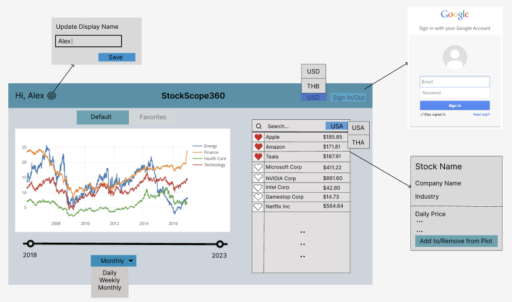

# StockScope360

## Project Summary:

The project aims to develop a comprehensive stock market visualization application that provides users with a smooth experience in tracking and analyzing stock prices. The application will feature a user-friendly interface where users can view stock prices for various stocks in one place, offering a comprehensive overview of the market trends, with the flexibility to customize the time frame and data frequency (i.e. weekly, monthly, or yearly data). Users will be able to create personalized lists of favorite stocks to focus only on the stocks that they are interested in, with the flexibility to convert the prices into their preferred currency for ease of understanding. Additionally, users can use the search bar to look up and access more detailed information about each stock, including the owner's company, its industry, and more. For security features, users can log in using Single Sign-On (SSO) through Google, enabling a secure and convenient authentication process to access their private configurations such as personalized stock lists and preferred currency.

## Description:

The stock market visualization application addresses the need for a user-friendly platform that simplifies stock tracking and analysis. The primary problem it aims to solve is the difficulty in comparing multiple stocks and identifying relevant information in one holistic view. Traditionally, users will be provided with the visualization of each stock’s prices in a completely independent and separate view, which leads to difficulties in comparing and analyzing different stocks.

The application aims to provide a solution by accumulating stock prices into a single graph, with flexibility for users to create their favorites list to focus only on stocks they are interested in. The intended use cases for the favorite list are for investors and financial enthusiasts who want to analyze and extract insights from stocks within the same industry, or the stocks that they already owned. For the default currency configuration, the goal is to provide users with the most natural sense of how sensible each stock pricing is, using the currency that they are most comfortable with. This increased efficiency in analyzing financial securities information empowers users to make more informed investment decisions. Apart from these new features, we recognize the value of features already existing in other traditional trading applications, such as choosing a time frame, choosing data frequency, and providing detailed information about each stock, and plan to provide them in our applications.

## Usefulness:

This project is particularly suitable for individuals who need to trade stocks on a daily basis. We will provide the graph of the price data for their selected stock from the past five years through the website. The visualization is very helpful for the users which allows them to have a common sense for the price trend of a particular stock in a more direct way. In addition to basic data browsing, users can also add stocks they are interested in into their own favorite list. They can save the corresponding data in their personal account for future browses. We will also provide data such as the name and category of each stock, as well as the current price trend of the stock for the day, making it convenient for users to obtain data and conduct effective analysis based on the data for a particular stock. The data we provided are extremely useful for the users to effectively predict the future trends of the stock market.

There are existing websites such as Yahoo Finance in the current market that can provide users with stock data for different periods. However, these well-known websites lack the integration of data from different national markets. Our website integrates data from the stock markets of the United States and Thailand. Additionally, we provide direct exchange rate conversion for different currencies in each market. This allows users to browse the data more directly without the need for separate calculations. It greatly enhances the efficiency of user data analysis and provides great assistance to users who need to trade in different national markets.

## Realness:

We are using data from Jan 1, 2019 to the present. For the U.S. stock market, we are using the current top 50 largest American companies by market cap. This list is obtained in a .csv format from companiesmarketcap.com. For each individual stock, we obtain data from YahooFinance as a .csv file regarding daily prices, weekly prices, and monthly prices. Pricing data include the open, high, low, close, adjusted close, as well as volume. We also obtain the company information from YahooFinance regarding the company’s full name and industry. For the Thai stock market, we are using the current SET50. This list is not obtainable in .csv format but is reasonable for manual input. The pricing and company information for each stock can be obtained from YahooFinanace as a .csv file in a similar manner as U.S. stocks. As for currency conversion, we use Investing.com to obtain the data as a .csv file regarding midmarket rates between Thai Baht and USD. We are only concerned about the average price for each day.

## Functionality Description:

This website provides users with a comprehensive platform for analyzing stock prices through an intuitive and user-friendly interface. Users can explore a dynamic price versus time plot that visually represents stock prices. The flexibility to choose the desired time frame for price visualization empowers users to tailor their analysis based on specific needs. An integrated search table accompanies the plot, allowing users to effortlessly locate and compare prices of individual stocks by typing into the search bar.

1. Intuitive Price versus Time Plot
   By default, the plot showcases the top 10 popular stocks in a plot with distinct colors for easy comparison. Users can add or remove stocks as they wish later. Below the plot, a simple slider allows users to select their desired time frame spanning the past five years, and a dropdown menu allows them to switch between daily, weekly, or monthly intervals.

2. Searchable Stock Table
   Users can type stock names in the search bar to find and click on them in the table for detailed info. A pop-up shows key details like stock name, company, industry, and daily price, with an option to add or remove the stock from the plot. The table also lets users switch between US and Thai markets with a dropdown.

3. Favorites View
   Users can add stocks to their favorites using the heart icon button located on the left side of each row in the search table. To access their Favorites stocks, above the plot, users will find a switch that toggles between the default view and the favorite view. It's important to note that the favorite view is disabled until users are signed in.

4. Currency Switch
   On the top bar, users will find a currency switcher button enabling them to toggle between different currency options displayed throughout the site. Presently, the available currencies include USD and THB, but we might include more if time permits.

5. Google Login
   The website features integration with Google login, with the sign-in button placed in the top right corner of the page. Users are encouraged to sign in using their Google accounts to unlock a personalized experience. Once clicked on, users will be redirected to google login page, and after signing in, users can enjoy benefits such as custom display names, the ability to add favorite stocks, and the convenience of having their currency and market preferences remembered for future visits.

6. Display Name customization
   Upon signing in with their Google account, users will see their display name displayed in the top left corner of the website. Adjacent to the display name, users can click on the settings icon to open a small popup window. Within this popup, users will find an input field where they can update their preferred display name.

## Low-fidelity UI Mockup:

## Project Work Distribution:

- Database
  - Data processing + setting up table
    - User Information(UserId, FirstName, LastName, DisplayName, email): Jake Wang
    - Favorites(UserId, StockId): Rachanon Petchoo
    - Stock metadata(StockId, StockName, OwnerCompany, Industry): Peter Li
    - Stock prices(..): Kantanat Pridaphatrakun
      - Opening price
      - Closing price
      - High (ceiling)
      - Low (floor)
      - Volume (optional)
      - Adjusted closing price (optional)
    - Conversion rates (CurrencyName, Date, Amount per 1 USD): Rachanon Petchoo
  - Stored procedures based on functionality
    - SP template for querying stock price for graph: Peter Li & Jake Wang
      - Favorites or not
      - Time
      - Data frequency
      - Stock display selection
    - SP template for querying stock name in table: Rachanon Petchoo
      - Current search keyword
      - USA/THA market
      - Currency (decide later - convert in SP or after SP)
    - SP for adding favorites stock: Kantanat Pridaphatrakun
      - Stock unique identifier
    - SP for updating user’s display name: Jake Wang
      - New display name
- Security
  - SSO: Jake Wang
- Frontend
  - Basic Layout: Jake Wang
  - Login button: Jake Wang
  - Display name update: Jake Wang
  - Graph
    - Plot: Kantanat Pridaphatrakun
    - Slider bar: Peter Li
    - Frequency button (weekly/monthly/etc.): Kantanat Pridaphatrakun
    - Default/ Favorites toggle: Peter Li
  - Stock table
    - Search bar: Rachanon Petchoo
    - Favorites button: Jake Wang
    - Currency list: Rachanon Petchoo
    - USA/THA Market toggle: Rachanon Petchoo
    - Display company page: Peter Li
